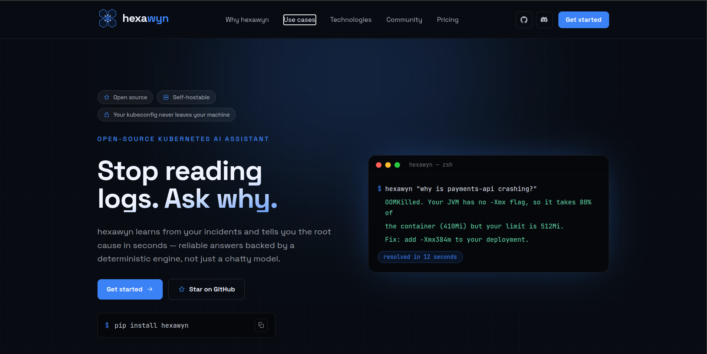

# hexawyn-web

> Less dashboards. More answers.

The marketing site for **hexawyn** — the open-source, self-hostable Kubernetes assistant that diagnoses incidents in seconds.



## Stack

- [Next.js 15](https://nextjs.org/) (App Router, React Server Components)
- TypeScript (strict)
- Tailwind CSS
- Framer Motion
- Vitest + Testing Library

## Development

```bash
npm install
npm run dev        # start the dev server on http://localhost:3000
```

## Scripts

```bash
npm run lint           # ESLint (next lint)
npm run typecheck      # tsc --noEmit
npm run test           # unit tests
npm run test:coverage  # unit tests + coverage report
npm run build          # production build
```

## Deployment

Continuous deployment is handled by Netlify's Git integration: pull requests get
Deploy Previews and merges to `main` ship to production. CI (lint, typecheck,
tests, coverage → Codecov) runs on GitHub Actions.
